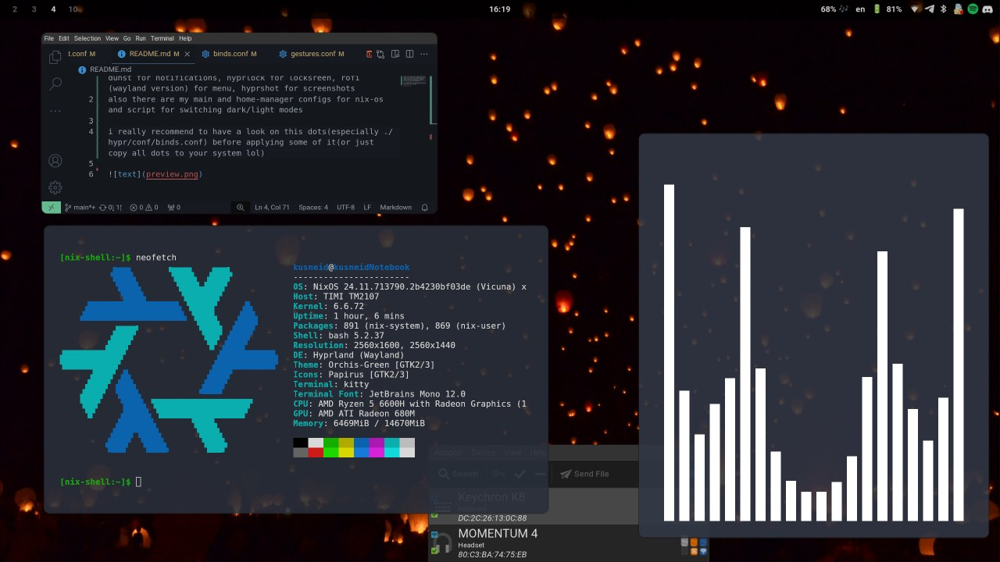
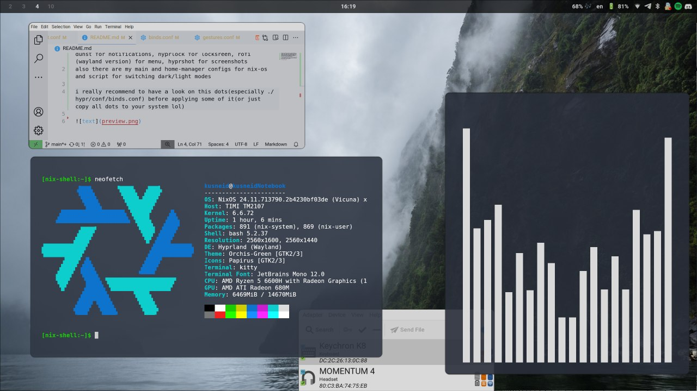

dotfiles for hyprland, terminal is kitty by default, to install execute ./install.sh, bluetooth and wifi applets located in tray, audio driver is pipewire, waybar for bar, dunst for notifications, hyprlock for locksreen, rofi(wayland version) for menu, hyprshot for screenshots
also there are my main and home-manager configs for nix-os and script for switching dark/light modes

i really recommend to have a look on this dots(especially ./hypr/conf/binds.conf) before applying some of it(or just copy all dots to your system lol)

