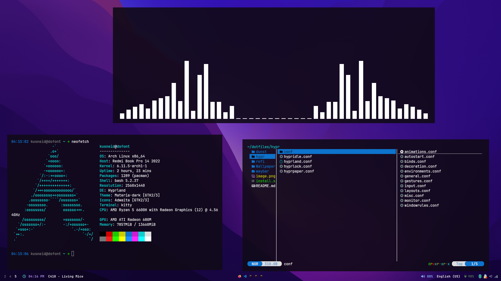

simple dotfiles for hyprland, terminal is kitty by default, to install execute ./install.sh, bluetooth and wifi applets located in tray, audio driver is pipewire, waybar for bar, dunst for notifications, hyprlock for locksreen, rofi(wayland version) for menu, hyprshot for screenshots

kde theme:
https://github.com/vinceliuice/Layan-kde
